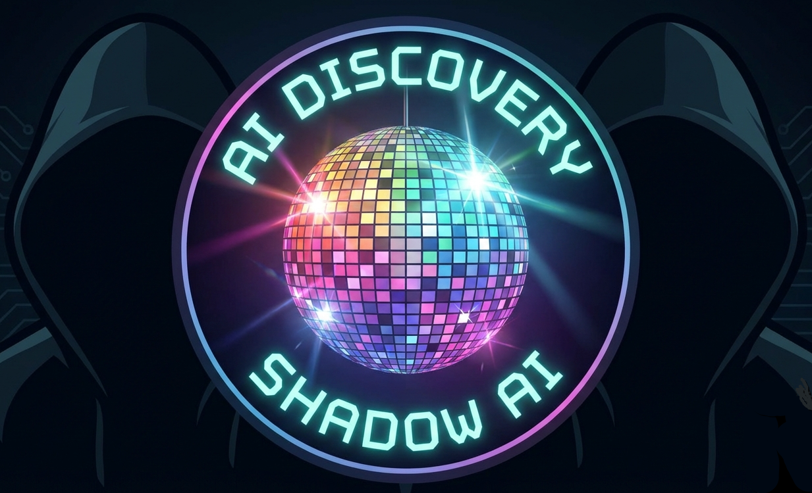

<p align="center">
  
</p>

# AI Discovery Scanner

A comprehensive Python-based scanner designed to detect common Local Large Language Model (LLM) software installations on Windows, macOS, and Linux systems. The scanner includes SIGMA rules for threat detection and monitoring.

## Features

### Supported LLM Software
- **Ollama**: Lightweight framework for running LLMs locally
- **LM Studio**: Desktop application for running LLMs with GUI
- **GPT4All**: Cross-platform desktop application for running local LLMs
- **vLLM**: High-performance inference library for LLMs
- **AI Development Tools**: GitHub Copilot, Replit Ghostwriter, Windsurf, Tabnine, Zed, Continue, Cursor
- **AI Chat Applications**: ChatGPT, Claude, Google Gemini, Brave Leo, Poe, YouChat, Chatbox
- **Open Source AI Platforms**: Open WebUI, AnythingLLM, LibreChat, Jan, Text Generation WebUI, LocalAI, Llamafile, Faraday, NVIDIA Chat with RTX
- **AI Discord Bots**: ClawdBot, OpenClaw, MoltBot (all variants of the same software)
- Extensible architecture for adding more LLM software detection

### Detection Methods
- **File System Paths**: Scans common installation directories
- **Registry Keys**: Windows registry entries (Windows only)
- **Environment Variables**: Detects LLM-related environment variables
- **Process Names**: Identifies running LLM processes
- **Network Ports**: Detects active LLM services on common ports
  - Ollama: Port 11434 (HTTP API)
  - LM Studio: Port 1234 (HTTP API)
  - GPT4All: Port 4891 (HTTP API)
  - vLLM: Port 8000 (HTTP API)
- **Comprehensive SIGMA Rules**: 78 detection rules covering process creation, file events, network activity, and environment variables
- **Cross-Platform Detection**: Optimized detection methods for Windows, macOS, and Linux systems

### Log Collection
- **Text-Only Log Gathering**: Collects only text-based logs, configuration files, and metadata
- **Smart File Filtering**: Automatically excludes binary files, executables, and large model files
- **Archive Creation**: Creates ZIP or 7z archives for easy retrieval
- **Process Information**: Captures running process details and memory usage
- **Environment Variables**: Records relevant environment configuration
- **Version Information**: Collects software versions from multiple sources (command-line, executable properties, config files)
- **Cross-Platform Support**: Works on Windows, macOS, and Linux

### SIGMA Rules Integration
- Comprehensive SIGMA rule collection for LLM software detection
- Compatible with major SIEM platforms (Splunk, Elasticsearch, Microsoft Sentinel)
- Customizable rules for different environments
- Automatic rule loading and matching

## Installation

1. **Clone or download the scanner files**
2. **Install Python dependencies:**
   ```bash
   pip install -r requirements.txt
   ```
3. **Ensure SIGMA rules directory exists:**
   ```bash
   mkdir -p sigma_rules
   ```

## Usage

### Basic Scan
```bash
python ai_discovery_scan.py
```

### Advanced Options
```bash
# Specify output file
python ai_discovery_scan.py --output custom_results.json

# Verbose output
python ai_discovery_scan.py --verbose

# Custom SIGMA rules directory
python ai_discovery_scan.py --sigma-dir /path/to/custom/rules

# Collect logs from detected LLM software
python ai_discovery_scan.py --collect-logs

# Collect logs in 7z format (requires 7zip to be installed)
python ai_discovery_scan.py --collect-logs --log-format 7z

# Only collect logs without running detection scan
python ai_discovery_scan.py --logs-only

# Set custom file size limit (50MB)
python ai_discovery_scan.py --collect-logs --max-file-size 50

# Combined options
python ai_discovery_scan.py -v -o detailed_scan.json --collect-logs --log-format zip
```

## File Structure

```
├── ai_discovery_scan.py        # Main scanner script
├── example_log_collection.py   # Example script for log collection
├── requirements.txt            # Python dependencies
├── sigma_rules/               # SIGMA rules directory (78 rules total)
│   ├── ollama_detection.yml              # Comprehensive Ollama detection
│   ├── lmstudio_detection.yml            # LM Studio detection
│   ├── gpt4all_detection.yml             # GPT4All desktop app detection
│   ├── vllm_detection.yml                # vLLM inference library detection
│   ├── github_copilot_process_detection.yml    # GitHub Copilot process detection
│   ├── github_copilot_file_detection.yml       # GitHub Copilot file detection
│   ├── github_copilot_env_detection.yml        # GitHub Copilot environment variables
│   ├── replit_ghostwriter_llm_software_detection.yml  # Replit Ghostwriter detection
│   ├── replit_ghostwriter_file_detection.yml          # Replit Ghostwriter file detection
│   ├── replit_ghostwriter_environment_variables.yml   # Replit Ghostwriter environment variables
│   ├── windsurf_ai_llm_software_detection.yml  # Windsurf AI detection
│   ├── windsurf_ai_file_detection.yml          # Windsurf AI file detection
│   ├── windsurf_ai_environment_variables.yml   # Windsurf AI environment variables
│   ├── tabnine_ai_llm_software_detection.yml   # Tabnine AI detection
│   ├── tabnine_ai_file_detection.yml           # Tabnine AI file detection
│   ├── tabnine_ai_environment_variables.yml    # Tabnine AI environment variables
│   ├── zed_editor_ai_llm_software_detection.yml  # Zed editor AI detection
│   ├── zed_editor_ai_file_detection.yml          # Zed editor AI file detection
│   ├── zed_editor_ai_environment_variables.yml   # Zed editor AI environment variables
│   ├── continue_ai_llm_software_detection.yml  # Continue AI detection
│   ├── continue_ai_file_detection.yml          # Continue AI file detection
│   ├── continue_ai_environment_variables.yml   # Continue AI environment variables
│   ├── cursor_process_detection.yml      # Cursor AI process detection
│   ├── cursor_file_detection.yml         # Cursor AI file detection
│   ├── cursor_env_detection.yml          # Cursor AI environment variables
│   ├── chatgpt_desktop_llm_software_detection.yml  # ChatGPT desktop detection
│   ├── chatgpt_desktop_file_detection.yml          # ChatGPT desktop file detection
│   ├── chatgpt_desktop_environment_variables.yml   # ChatGPT desktop environment variables
│   ├── claude_ai_llm_software_detection.yml  # Claude AI detection
│   ├── claude_ai_file_detection.yml          # Claude AI file detection
│   ├── claude_ai_environment_variables.yml   # Claude AI environment variables
│   ├── google_gemini_ai_llm_software_detection.yml  # Google Gemini AI detection
│   ├── google_gemini_ai_file_detection.yml          # Google Gemini AI file detection
│   ├── google_gemini_ai_environment_variables.yml   # Google Gemini AI environment variables
│   ├── brave_leo_ai_llm_software_detection.yml  # Brave Leo AI detection
│   ├── brave_leo_ai_file_detection.yml          # Brave Leo AI file detection
│   ├── brave_leo_ai_environment_variables.yml   # Brave Leo AI environment variables
│   ├── poe_ai_llm_software_detection.yml  # Poe AI detection
│   ├── poe_ai_file_detection.yml          # Poe AI file detection
│   ├── poe_ai_environment_variables.yml   # Poe AI environment variables
│   ├── youchat_youcom_ai_llm_software_detection.yml  # YouChat/You.com AI detection
│   ├── youchat_youcom_ai_file_detection.yml          # YouChat/You.com AI file detection
│   ├── youchat_youcom_ai_environment_variables.yml   # YouChat/You.com AI environment variables
│   ├── chatbox_process_detection.yml     # Chatbox AI process detection
│   ├── chatbox_file_detection.yml        # Chatbox AI file detection
│   ├── chatbox_env_detection.yml         # Chatbox AI environment variables
│   ├── open_webui_llm_software_detection.yml  # Open WebUI detection
│   ├── open_webui_file_detection.yml          # Open WebUI file detection
│   ├── open_webui_environment_variables.yml   # Open WebUI environment variables
│   ├── anythingllm_llm_software_detection.yml  # AnythingLLM detection
│   ├── anythingllm_file_detection.yml          # AnythingLLM file detection
│   ├── anythingllm_environment_variables.yml   # AnythingLLM environment variables
│   ├── librechat_llm_software_detection.yml  # LibreChat detection
│   ├── librechat_file_detection.yml          # LibreChat file detection
│   ├── librechat_environment_variables.yml   # LibreChat environment variables
│   ├── jan_ai_llm_software_detection.yml  # Jan AI detection
│   ├── jan_ai_file_detection.yml          # Jan AI file detection
│   ├── jan_ai_environment_variables.yml   # Jan AI environment variables
│   ├── text_generation_webui_oobabooga_llm_software_detection.yml  # Text Generation WebUI detection
│   ├── text_generation_webui_oobabooga_file_detection.yml          # Text Generation WebUI file detection
│   ├── text_generation_webui_oobabooga_environment_variables.yml   # Text Generation WebUI environment variables
│   ├── localai_llm_software_detection.yml  # LocalAI detection
│   ├── localai_file_detection.yml          # LocalAI file detection
│   ├── localai_environment_variables.yml   # LocalAI environment variables
│   ├── llamafile_llamacpp_llm_software_detection.yml  # Llamafile/llama.cpp detection
│   ├── llamafile_llamacpp_file_detection.yml          # Llamafile/llama.cpp file detection
│   ├── faraday_ai_llm_software_detection.yml  # Faraday AI detection
│   ├── faraday_ai_file_detection.yml          # Faraday AI file detection
│   ├── faraday_ai_environment_variables.yml   # Faraday AI environment variables
│   ├── nvidia_chat_with_rtx_llm_software_detection.yml  # NVIDIA Chat with RTX detection
│   ├── nvidia_chat_with_rtx_file_detection.yml          # NVIDIA Chat with RTX file detection
│   ├── nvidia_chat_with_rtx_environment_variables.yml   # NVIDIA Chat with RTX environment variables
│   ├── clawdbot_process_detection.yml     # ClawdBot/OpenClaw/MoltBot process detection
│   ├── clawdbot_dns_detection.yml         # ClawdBot/OpenClaw/MoltBot DNS detection
│   ├── clawdbot_file_detection.yml        # ClawdBot/OpenClaw/MoltBot file detection
│   ├── clawdbot_environment_variables.yml # ClawdBot/OpenClaw/MoltBot environment variables
│   ├── clawdbot_llm_software_detection.yml  # ClawdBot/OpenClaw/MoltBot LLM software detection
│   └── clawdbot_network_detection.yml     # ClawdBot/OpenClaw/MoltBot network and API detection
└── README.md                  # This file
```

## Log Collection

The scanner includes comprehensive log collection capabilities for forensic analysis and incident response.

### What Gets Collected

#### Ollama Logs
- **Installation directories**: `~/.ollama`, `AppData/Local/Programs/Ollama`, etc.
- **Configuration files**: Model configurations, server settings
- **Process information**: Running Ollama processes, memory usage, command lines
- **Environment variables**: `OLLAMA_HOST`, `OLLAMA_MODELS`, etc.
- **Version information**: Software version from `ollama --version`, executable properties, config files

#### LM Studio Logs
- **Installation directories**: `AppData/Local/LMStudio`, `~/.cache/lm-studio`, etc.
- **Configuration files**: Application settings, model configurations
- **Process information**: Running LM Studio processes, memory usage
- **Environment variables**: `LMSTUDIO_MODELS_DIR`, `LM_STUDIO_HOME`, etc.
- **Version information**: Software version from executable properties, config files, settings files

#### GPT4All Logs
- **Installation directories**: `AppData/Local/GPT4All`, `AppData/Roaming/GPT4All`, etc.
- **Configuration files**: Application settings, model configurations
- **Process information**: Running GPT4All processes, memory usage
- **Environment variables**: `GPT4ALL_MODEL_PATH`, `GPT4ALL_HOME`, `GPT4ALL_DATA_DIR`
- **Version information**: Software version from executable properties, config files, package.json

#### vLLM Logs
- **Installation directories**: `~/.vllm`, `~/vllm`, etc.
- **Configuration files**: Model configurations, server settings
- **Process information**: Running vLLM processes, memory usage, command lines
- **Environment variables**: `VLLM_HOME`, `VLLM_MODEL_PATH`, `VLLM_DATA_DIR`, `CUDA_VISIBLE_DEVICES`
- **Version information**: Software version from Python package, command-line, setup files
- **Python package info**: Package installation details, version, location

### File Filtering
The scanner automatically excludes binary files and large files to keep archives manageable:
- **Text files only**: `.txt`, `.log`, `.json`, `.yml`, `.yaml`, `.xml`, `.csv`, `.md`, `.ini`, `.cfg`, `.conf`, `.env`, `.bat`, `.sh`, `.ps1`, `.py`, `.js`, `.html`, `.css`, `.sql`, `.sqlite`, `.db`
- **Excluded binary files**: `.exe`, `.dll`, `.so`, `.dylib`, `.bin`, `.safetensors`, `.gguf`, `.ggml`, `.model`, `.weights`, `.pth`, `.pt`, `.ckpt`, `.h5`, `.pb`, `.onnx`, `.pkl`, `.pickle`, `.joblib`, `.npy`, `.npz`, `.parquet`, `.feather`, `.zip`, `.tar`, `.gz`, `.bz2`, `.7z`, `.rar`, `.iso`, `.img`, `.jpg`, `.jpeg`, `.png`, `.gif`, `.bmp`, `.tiff`, `.ico`, `.svg`, `.mp3`, `.mp4`, `.avi`, `.mov`, `.wav`, `.flac`, `.ogg`, `.pdf`, `.doc`, `.docx`, `.xls`, `.xlsx`, `.ppt`, `.pptx`
- **Size threshold**: Files larger than 100MB (configurable)
- **Binary detection**: Additional checks for binary file signatures and null bytes
- **Placeholder files**: Creates `.skipped` files indicating what was excluded

### Archive Formats
- **ZIP**: Default format, compatible with all systems
- **7z**: Higher compression, requires 7zip to be installed

### Usage Examples
```bash
# Collect logs after detection scan
python llm_scanner.py --collect-logs

# Collect logs only (skip detection scan)
python llm_scanner.py --logs-only

# Use 7z format for better compression
python llm_scanner.py --logs-only --log-format 7z

# Run example script
python example_log_collection.py
```

## Detection Details

### Ollama Detection
- **Installation Paths:**
  - Windows: `%USERPROFILE%\.ollama`, `C:\Program Files\Ollama`
  - macOS: `/Applications/Ollama.app`, `~/.ollama`
  - Linux: `/usr/bin/ollama`, `/usr/share/ollama`, `~/.ollama`
- **Environment Variables:** `OLLAMA_MODELS`, `OLLAMA_HOST`, `OLLAMA_HOME`
- **Process Names:** `ollama.exe`, `ollama`
- **Default Port:** 11434
- **Registry Keys:** `HKEY_CURRENT_USER\Software\Ollama`, `HKEY_LOCAL_MACHINE\Software\Ollama`

### LM Studio Detection
- **Installation Paths:**
  - Windows: `%APPDATA%\LMStudio`, `%LOCALAPPDATA%\LMStudio`
  - macOS: `/Applications/LM Studio.app`, `~/.cache/lm-studio`
  - Linux: `~/.cache/lm-studio`, `~/LMStudio`
- **Environment Variables:** `LMSTUDIO_MODELS_DIR`, `LM_STUDIO_HOME`
- **Process Names:** `LMStudio.exe`, `lmstudio.exe`, `lm-studio.exe`
- **Default Port:** 1234
- **Registry Keys:** `HKEY_CURRENT_USER\Software\LMStudio`

### GPT4All Detection
- **Installation Paths:**
  - Windows: `%LOCALAPPDATA%\GPT4All`, `%APPDATA%\GPT4All`, `C:\Program Files\GPT4All`
  - macOS: `/Applications/GPT4All.app`, `~/Applications/GPT4All.app`
  - Linux: `~/.gpt4all`, `~/.local/share/gpt4all`, `/opt/gpt4all`
- **Environment Variables:** `GPT4ALL_MODEL_PATH`, `GPT4ALL_HOME`, `GPT4ALL_DATA_DIR`
- **Process Names:** `GPT4All.exe`, `gpt4all.exe`, `gpt4all-app.exe`
- **Default Port:** 4891
- **Registry Keys:** `HKEY_CURRENT_USER\Software\GPT4All`, `HKEY_LOCAL_MACHINE\Software\GPT4All`

### vLLM Detection
- **Installation Paths:**
  - Windows: `%LOCALAPPDATA%\vLLM`, `%APPDATA%\vLLM`, `~/.vllm`
  - macOS: `~/.vllm`, `~/vllm`, `~/Library/Application Support/vLLM`
  - Linux: `~/.vllm`, `~/vllm`, `/opt/vllm`, `/usr/local/vllm`
- **Environment Variables:** `VLLM_HOME`, `VLLM_MODEL_PATH`, `VLLM_DATA_DIR`, `CUDA_VISIBLE_DEVICES`
- **Process Names:** `vllm`, `vllm-engine`, `vllm-serve`, `vllm-worker`, `python.*vllm`
- **Default Port:** 8000
- **Python Package:** `vllm` (primary detection method)
- **Registry Keys:** `HKEY_CURRENT_USER\Software\vLLM`, `HKEY_LOCAL_MACHINE\Software\vLLM`

## SIGMA Rules

The scanner includes 78 comprehensive SIGMA rules for LLM software detection:

### Core LLM Software (4 rules)
1. **ollama_detection.yml** - Comprehensive Ollama detection covering processes, files, network activity, and environment variables
2. **lmstudio_detection.yml** - LM Studio detection for processes, files, and network connections
3. **gpt4all_detection.yml** - GPT4All desktop application detection across multiple platforms
4. **vllm_detection.yml** - vLLM inference library detection including Python package analysis

### AI Development Tools (21 rules)
5. **github_copilot_process_detection.yml** - GitHub Copilot process detection
6. **github_copilot_file_detection.yml** - GitHub Copilot file detection
7. **github_copilot_env_detection.yml** - GitHub Copilot environment variables
8. **replit_ghostwriter_llm_software_detection.yml** - Replit Ghostwriter software detection
9. **replit_ghostwriter_file_detection.yml** - Replit Ghostwriter file detection
10. **replit_ghostwriter_environment_variables.yml** - Replit Ghostwriter environment variables
11. **windsurf_ai_llm_software_detection.yml** - Windsurf AI software detection
12. **windsurf_ai_file_detection.yml** - Windsurf AI file detection
13. **windsurf_ai_environment_variables.yml** - Windsurf AI environment variables
14. **tabnine_ai_llm_software_detection.yml** - Tabnine AI software detection
15. **tabnine_ai_file_detection.yml** - Tabnine AI file detection
16. **tabnine_ai_environment_variables.yml** - Tabnine AI environment variables
17. **zed_editor_ai_llm_software_detection.yml** - Zed editor AI software detection
18. **zed_editor_ai_file_detection.yml** - Zed editor AI file detection
19. **zed_editor_ai_environment_variables.yml** - Zed editor AI environment variables
20. **continue_ai_llm_software_detection.yml** - Continue AI software detection
21. **continue_ai_file_detection.yml** - Continue AI file detection
22. **continue_ai_environment_variables.yml** - Continue AI environment variables
23. **cursor_process_detection.yml** - Cursor AI process detection
24. **cursor_file_detection.yml** - Cursor AI file detection
25. **cursor_env_detection.yml** - Cursor AI environment variables

### AI Chat Applications (21 rules)
26. **chatgpt_desktop_llm_software_detection.yml** - ChatGPT desktop software detection
27. **chatgpt_desktop_file_detection.yml** - ChatGPT desktop file detection
28. **chatgpt_desktop_environment_variables.yml** - ChatGPT desktop environment variables
29. **claude_ai_llm_software_detection.yml** - Claude AI software detection
30. **claude_ai_file_detection.yml** - Claude AI file detection
31. **claude_ai_environment_variables.yml** - Claude AI environment variables
32. **google_gemini_ai_llm_software_detection.yml** - Google Gemini AI software detection
33. **google_gemini_ai_file_detection.yml** - Google Gemini AI file detection
34. **google_gemini_ai_environment_variables.yml** - Google Gemini AI environment variables
35. **brave_leo_ai_llm_software_detection.yml** - Brave Leo AI software detection
36. **brave_leo_ai_file_detection.yml** - Brave Leo AI file detection
37. **brave_leo_ai_environment_variables.yml** - Brave Leo AI environment variables
38. **poe_ai_llm_software_detection.yml** - Poe AI software detection
39. **poe_ai_file_detection.yml** - Poe AI file detection
40. **poe_ai_environment_variables.yml** - Poe AI environment variables
41. **youchat_youcom_ai_llm_software_detection.yml** - YouChat/You.com AI software detection
42. **youchat_youcom_ai_file_detection.yml** - YouChat/You.com AI file detection
43. **youchat_youcom_ai_environment_variables.yml** - YouChat/You.com AI environment variables
44. **chatbox_process_detection.yml** - Chatbox AI process detection
45. **chatbox_file_detection.yml** - Chatbox AI file detection
46. **chatbox_env_detection.yml** - Chatbox AI environment variables

### Open Source AI Platforms (26 rules)
47. **open_webui_llm_software_detection.yml** - Open WebUI software detection
48. **open_webui_file_detection.yml** - Open WebUI file detection
49. **open_webui_environment_variables.yml** - Open WebUI environment variables
50. **anythingllm_llm_software_detection.yml** - AnythingLLM software detection
51. **anythingllm_file_detection.yml** - AnythingLLM file detection
52. **anythingllm_environment_variables.yml** - AnythingLLM environment variables
53. **librechat_llm_software_detection.yml** - LibreChat software detection
54. **librechat_file_detection.yml** - LibreChat file detection
55. **librechat_environment_variables.yml** - LibreChat environment variables
56. **jan_ai_llm_software_detection.yml** - Jan AI software detection
57. **jan_ai_file_detection.yml** - Jan AI file detection
58. **jan_ai_environment_variables.yml** - Jan AI environment variables
59. **text_generation_webui_oobabooga_llm_software_detection.yml** - Text Generation WebUI (Oobabooga) software detection
60. **text_generation_webui_oobabooga_file_detection.yml** - Text Generation WebUI file detection
61. **text_generation_webui_oobabooga_environment_variables.yml** - Text Generation WebUI environment variables
62. **localai_llm_software_detection.yml** - LocalAI software detection
63. **localai_file_detection.yml** - LocalAI file detection
64. **localai_environment_variables.yml** - LocalAI environment variables
65. **llamafile_llamacpp_llm_software_detection.yml** - Llamafile/llama.cpp software detection
66. **llamafile_llamacpp_file_detection.yml** - Llamafile/llama.cpp file detection
67. **faraday_ai_llm_software_detection.yml** - Faraday AI software detection
68. **faraday_ai_file_detection.yml** - Faraday AI file detection
69. **faraday_ai_environment_variables.yml** - Faraday AI environment variables
70. **nvidia_chat_with_rtx_llm_software_detection.yml** - NVIDIA Chat with RTX software detection
71. **nvidia_chat_with_rtx_file_detection.yml** - NVIDIA Chat with RTX file detection
72. **nvidia_chat_with_rtx_environment_variables.yml** - NVIDIA Chat with RTX environment variables

### AI Discord Bots - ClawdBot/OpenClaw/MoltBot (6 rules)
73. **clawdbot_process_detection.yml** - ClawdBot/OpenClaw/MoltBot process execution detection (all variants in one rule)
74. **clawdbot_dns_detection.yml** - ClawdBot/OpenClaw/MoltBot DNS query detection (all variants in one rule)
75. **clawdbot_file_detection.yml** - ClawdBot/OpenClaw/MoltBot file system activity detection (all variants in one rule)
76. **clawdbot_environment_variables.yml** - ClawdBot/OpenClaw/MoltBot environment variable detection (all variants in one rule)
77. **clawdbot_llm_software_detection.yml** - ClawdBot/OpenClaw/MoltBot LLM software detection (all variants in one rule)
78. **clawdbot_network_detection.yml** - ClawdBot/OpenClaw/MoltBot network traffic and API detection (all variants in one rule)

### Rule Coverage
Each SIGMA rule provides comprehensive detection for:
- **Process Creation**: Detects when LLM software is executed
- **Network Activity**: Monitors API server connections and port usage
- **File Events**: Tracks installation directories and configuration files
- **Environment Variables**: Configuration and path detection
- **Cross-Platform Support**: Windows, macOS, and Linux detection methods

### Rule Categories
- **Process Creation**: Detects when LLM software is executed
- **Network Activity**: Monitors API server connections
- **File Events**: Tracks installation and model storage
- **Registry Events**: Windows-specific registry monitoring
- **Environment Variables**: Configuration detection

### Rule Structure
Each SIGMA rule follows the standard SIGMA format with:
- **Detection**: Selection criteria for processes, files, and environment variables
- **Condition**: Logical operators to combine detection criteria
- **Metadata**: Rule information, tags, and MITRE ATT&CK mappings
- **Cross-Platform Support**: Detection methods optimized for Windows, macOS, and Linux

### MITRE ATT&CK Mapping
- **T1059**: Command and Scripting Interpreter
- **T1071.001**: Application Layer Protocol (Web Protocols)
- **T1071.004**: Application Layer Protocol (DNS)
- **T1041**: Exfiltration Over C2 Channel
- **T1082**: System Information Discovery
- **T1018**: Remote System Discovery
- **T1547**: Boot or Logon Autostart Execution
- **T1547.001**: Registry Run Keys / Startup Folder

## Output Format

The scanner produces both JSON and human-readable output formats:

### JSON Output
The scanner produces JSON output with the following structure:

```json
{
  "scan_timestamp": "2024-08-29T15:30:45.123456",
  "system_info": {
    "os": "Windows",
    "release": "10",
    "architecture": "AMD64",
    "python_version": "3.9.7"
  },
  "detections": [
    {
      "software": "Ollama",
      "detection_type": "file_path",
      "value": "C:\Users\user\.ollama",
      "path": "C:\Users\user\.ollama",
      "confidence": "high"
    }
  ],
  "sigma_matches": [
    {
      "rule_id": "12345678-1234-5678-9abc-123456789012",
      "rule_title": "Ollama Process Execution Detected",
      "detection": {
        "software": "Ollama",
        "type": "process",
        "value": "PID: 1234, Name: ollama.exe"
      },
      "level": "medium"
    }
  ],
  "summary": {
    "total_detections": 5,
    "software_found": ["Ollama", "LM Studio"],
    "high_confidence": 4,
    "medium_confidence": 1
  }
}
```

### Human-Readable Summary
The scanner also generates a comprehensive human-readable summary report that includes:

- **Header Information**: Scan date, machine name, operating system
- **Scan Summary**: Total detections, software found, confidence levels
- **Detailed Detections**: Each detection with type, value, and confidence
- **SIGMA Rule Matches**: Security rule matches with descriptions
- **Recommendations**: Actionable security recommendations

### File Naming Convention
- **Auto-generated filenames**: `output/ai_discovery_results_{machine_name}_{timestamp}.json`
- **Summary files**: `output/{json_filename}_summary.txt`
- **Log archives**: `output/ai_discovery_logs_{timestamp}.zip`
- **Custom filenames**: User-specified names are supported via `--output` parameter (saved in `output/` directory)

### Example Output Files
```
output/ai_discovery_results_AIPC6969_20250830_011711.json
output/ai_discovery_results_AIPC6969_20250830_011711_summary.txt
output/ai_discovery_logs_20250830_011711.zip
```

## Confidence Levels

- **High**: Direct file/process/registry evidence
- **Medium**: Network port activity, environment variables
- **Low**: Indirect indicators

## Platform Support

- **Windows**: Full support including registry detection
- **macOS**: File system, process, and network detection
- **Linux**: File system, process, and network detection

## Security Considerations

This scanner is designed for:
- **Security monitoring**: Detect unauthorized LLM software installations
- **Compliance auditing**: Inventory LLM software in enterprise environments
- **Incident response**: Identify potential data exfiltration via local LLMs
- **Asset management**: Track AI/ML tool deployments

## Extending the Scanner

### Adding New LLM Software
1. Create detection methods in the main scanner class
2. Add new SIGMA rules in the `sigma_rules/` directory
3. Update the `run_scan()` method to include new software

### Custom SIGMA Rules
Create new `.yml` files in the `sigma_rules/` directory following the SIGMA standard format.

## Dependencies

- **psutil**: System and process monitoring
- **PyYAML**: SIGMA rule parsing
- **pathlib**: Cross-platform path handling
- **zipfile**: Archive creation (built-in)
- **shutil**: File operations (built-in)
- **Standard library**: os, sys, json, platform, subprocess, socket

### Optional Dependencies
- **7zip**: For 7z archive format support (command line tool must be in PATH)

## License

This scanner is provided for security research and monitoring purposes. Use in accordance with your organization's security policies and applicable laws.

## Contributing

To contribute:
1. Add new LLM software detection methods
2. Create additional SIGMA rules
3. Improve cross-platform compatibility
4. Enhance detection accuracy

## Changelog

- **v1.4**: ClawdBot/OpenClaw/MoltBot Consolidated Detection
  - Updated all 6 ClawdBot Sigma rules to detect all three variants (ClawdBot, OpenClaw, MoltBot) in a single consolidated rule set
  - Each rule contains dedicated selection blocks per variant with an OR condition for comprehensive detection
  - Added OpenClaw-specific indicators: `oc-`/`ocl-` bearer token prefixes, OpenClaw domain infrastructure, SDK user-agent strings, API endpoint patterns, and model names
  - Added MoltBot-specific indicators: `mb-`/`mbt-` bearer token prefixes, MoltBot domain infrastructure, SDK user-agent strings, API endpoint patterns, and model names
  - Updated README to reflect all 78 SIGMA rule files with actual filenames

- **v1.3**: Comprehensive AI Application Detection Expansion
  - Added 21 new AI applications with comprehensive SIGMA rules
  - Enhanced detection for GitHub Copilot, Replit Ghostwriter, Windsurf, Tabnine, Zed, Continue, ChatGPT, Claude, Google Gemini, Brave Leo, Poe, YouChat, Open WebUI, AnythingLLM, LibreChat, Jan, Text Generation WebUI, LocalAI, Llamafile, Faraday, and NVIDIA Chat with RTX
  - Added Cursor AI code editor and Chatbox AI chat application detection
  - Implemented comprehensive SIGMA rule-based detection system
  - Enhanced scanner to utilize all 73 SIGMA rules for active detection
  - Fixed compatibility issues between custom and standard SIGMA rule formats
  - Improved process, file, and environment variable detection methods

- **v1.2**: Added GPT4All and vLLM support
  - Comprehensive detection for GPT4All desktop application
  - vLLM inference library detection and Python package analysis
  - Extended log collection for both new software types
  - Additional network port monitoring (GPT4All: 4891, vLLM: 8000)
  - Enhanced version collection methods for new software

- **v1.1**: Enhanced reporting and file naming
  - Human-readable summary reports
  - Auto-generated filenames with timestamp and machine name
  - Comprehensive recommendations section
  - Improved output formatting

- **v1.0**: Initial release with Ollama and LM Studio detection
  - Comprehensive SIGMA rule collection
  - Cross-platform support
  - JSON output format
  - Log collection capabilities
  - Version information collection
